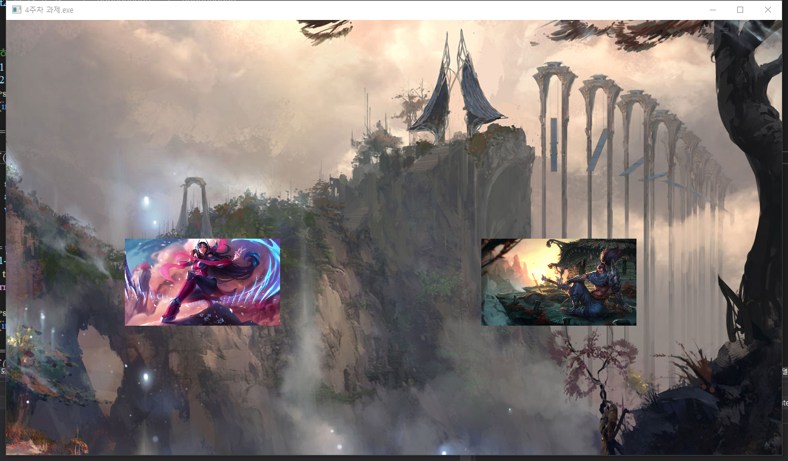
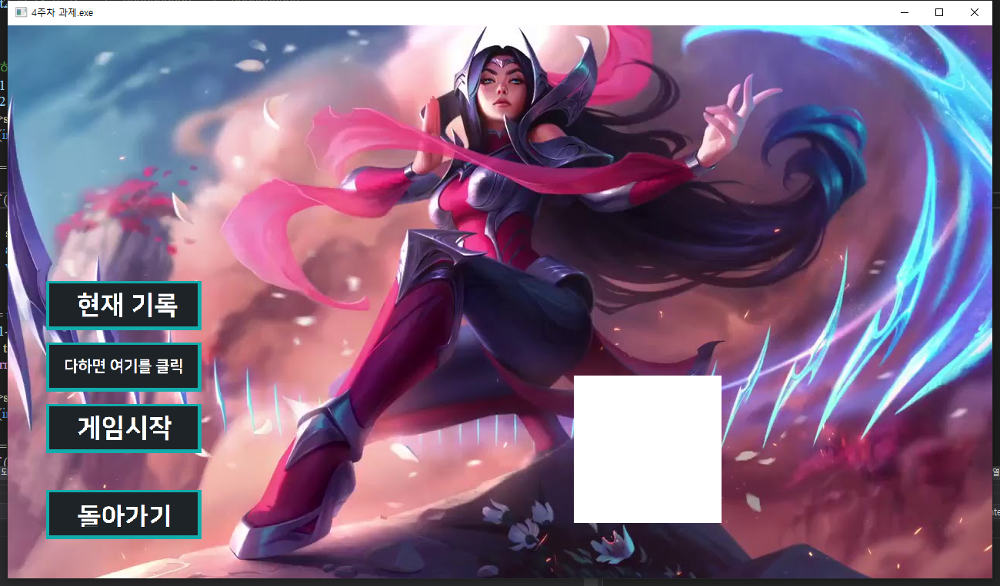
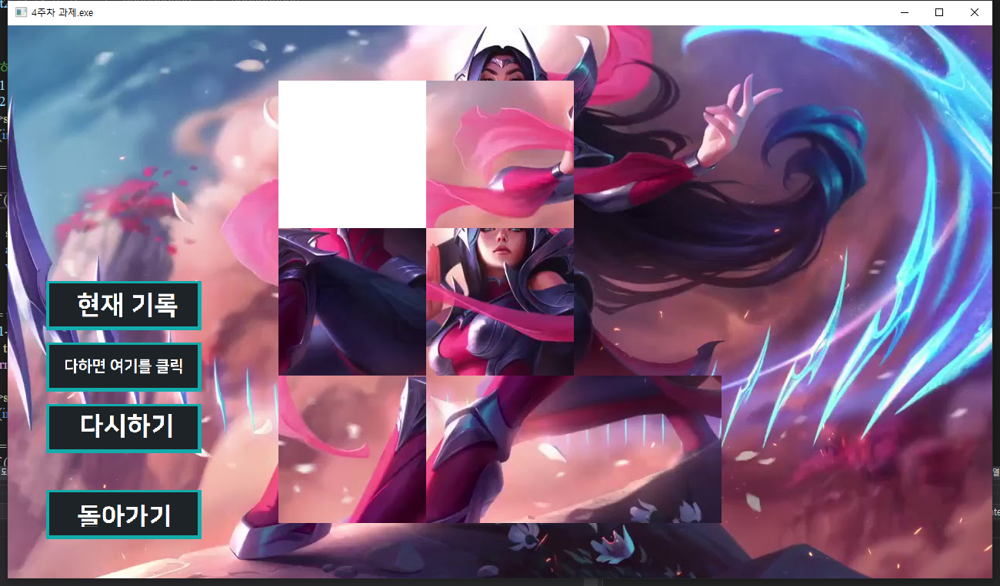
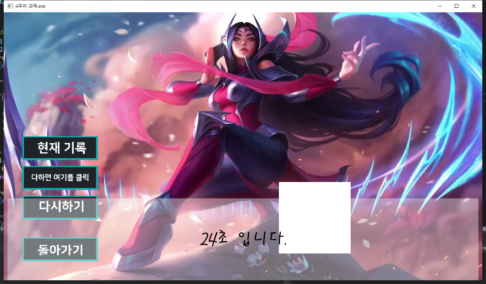
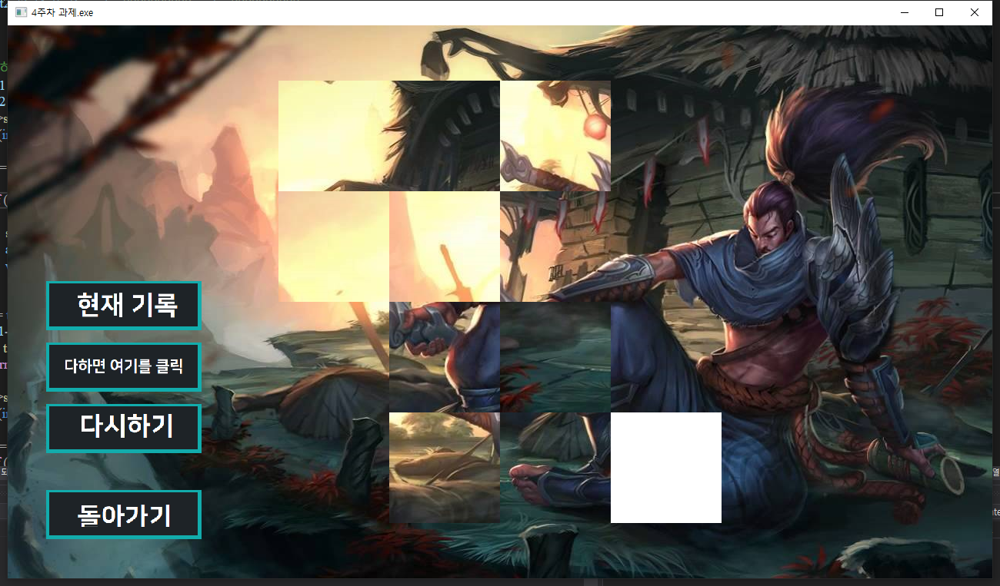

## 퍼즐 게임 입니다

실행하시면 그림과 같은 화면이 뜹니다.

이 게임은 **복수 이미지에 대해서 게임을 제공**합니다! 이렐리아(쉬운 3*3퍼즐)와 야스오(어려운 4*4 퍼즐) 중 하나를 선택하여 플레이 할 수 있습니다.

우선 이렐리아를 플레이 하는 모습을 보여드리겠습니다.
~~설명을 위해 섞는 블록의 개수를 대폭 낮췄습니다.~~

게임 시작 버튼을 눌러주시면 퍼즐들이 무작위로 섞이게 됩니다.

첫번째 판이라서 바로 **신기록**이 나왔네요. **최고 기록 갱신을 알려줍니다.**

여기서 다시하기를 누르면 퍼즐이 다시 섞이는데 이때부터 또 시간을 측정해서 신기록인지 아닌지 알려줍니다.
신기록이라면, "신기록입니다!"라는 문구가 뜨고
신기록이 아니라면, "축하합니다"라는 문구가 나옵니다.

만약 퍼즐을 다 맞추기 못했는데 완료를 누른다면, "한 놈도 살려두지 마라!"라는 이렐리아의 대사가 나오게 됩니다.

걸린 시간 확인은 게임을 완료하고 **현재 기록** 버튼을 누르시면 **가장 최근에 한 게임의 종료시 해결하는 데에 걸린 시간을 알려줍니다.**

야스오도 이렐리아와 퍼즐 크기만 다를뿐, 내용은 같습니다.

그럼 재미있게 플레이하세요~
